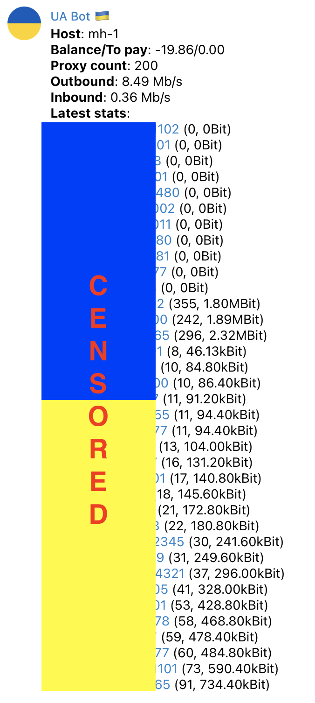

## Installer for [mhddos_proxy](https://github.com/porthole-ascend-cinnamon/mhddos_proxy) tool on DigitalOcean

## Опис Українською

Введіть 3 значеня у скрипті та отримайте повністю налаштованний [mhddos_proxy](https://github.com/porthole-ascend-cinnamon/mhddos_proxy) з нотіфікаціями у Телеграм.

### Відео інструкція
YouTube - у процессі

### Текстова інструкція
1. Створить DigitalOcean аккаунт (використайте [реферальне посилання](https://m.do.co/c/c5f2c078f46e) та отримайте $100 кредиту, або використайте [один з промокодів](https://www.newcoupons.info/digitalocean-coupon-codes/))
2. Створіть DigitalOcean [Personal Access Token](https://docs.digitalocean.com/reference/api/create-personal-access-token/)
3. Створіть Телеграм бот та [отримайте токен](https://docs.digitalocean.com/reference/api/create-personal-access-token/)
4. Напишіть `/start` вашому боту (відповіді не буде)
5. Отримайте ваш [Chat ID](https://www.alphr.com/find-chat-id-telegram/)
6. Почніть створювати Droplet, обирайте:
    - Ubuntu 20.04
    - Basic
    - Regular, $15/month, 2 GB / 2 CPU
    - Amsterdam / London / Frankfurt
    - Password, введіть будь-який пароль
    - Увімкніть Monitoring
    - Увімкніть Userdata
7. Вставте контент mhddos_setup.sh файлу у поле `User data`
8. Замінить значення `TG_TOKEN`, `TG_CHAT_ID`, `DIGITALOCEAN_TOKEN` змінних на ваші значенная з пунктів 2, 3, 5.
9. Зазначте кількість Dropleps яку ви бажаєте створити (рекомендую 2 дроплета на аккаунт, ви можете мати декілька аккаунтів)
10. Нажміть `Create Droplet` та насолоджуйтесь

Якщо все добре, ви отримаєте нотіфікацію у Телеграм не пізніше ніж через 4 години.

## English description

Fill in 3 variables and get ready-to-go [mhddos_proxy](https://github.com/porthole-ascend-cinnamon/mhddos_proxy) installation with notifications to Telegram.

### Video instruction
YouTube - to be done

### Text instruction
1. Register DigitalOcean account (use [referral link](https://m.do.co/c/c5f2c078f46e) to get $100 credits, or use [one of the promocodes](https://www.newcoupons.info/digitalocean-coupon-codes/)) 
2. Create DigitalOcean [Personal Access Token](https://docs.digitalocean.com/reference/api/create-personal-access-token/)
3. Create Telegram Bot and [get the token](https://docs.digitalocean.com/reference/api/create-personal-access-token/)
4. Type `/start` to your bot (will be no response)
5. Get your [Chat ID](https://www.alphr.com/find-chat-id-telegram/)
6. Start Droplet creation
    - Ubuntu 20.04
    - Basic
    - Regular, $15/month, 2 GB / 2 CPU
    - Amsterdam / London / Frankfurt
    - Password, set any password
    - Enable Monitoring
    - Enable Userdata
7. Paste content of mhddos_setup.sh file into the `User data` field
8. Replace values for `TG_TOKEN`, `TG_CHAT_ID`, `DIGITALOCEAN_TOKEN` variables with your values from steps 2, 3, 5.
9. Set number of Droplets you want to deploy (recommended 2 droplets per account, you can have multiple accounts)
10. Click `Create Droplet` and enjoy

If everything is alright, you'll receive a notification to your Telegram maximum in 4 hrs.

