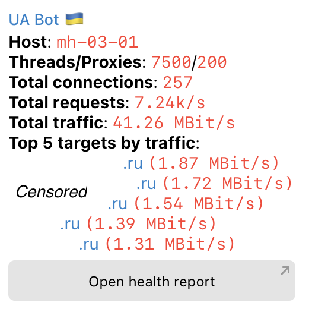
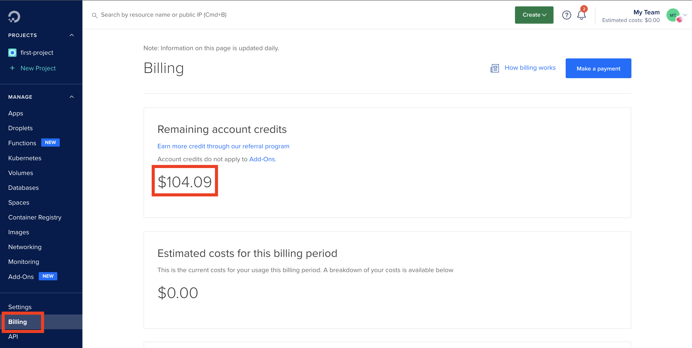
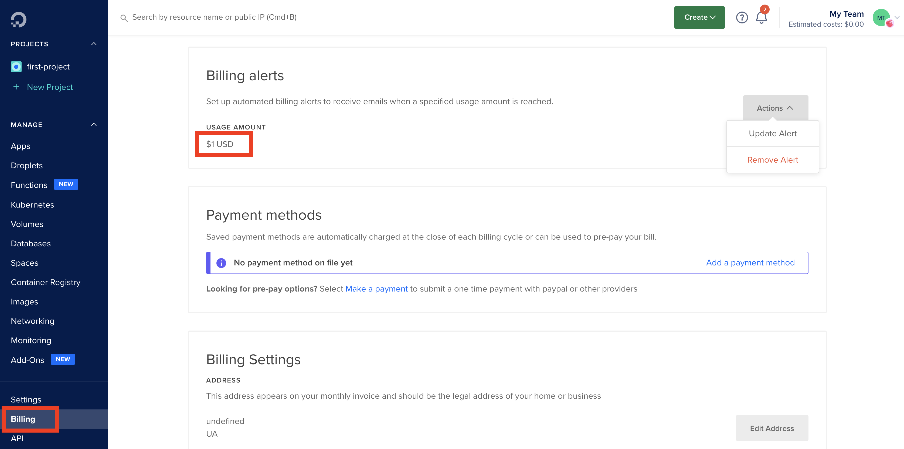
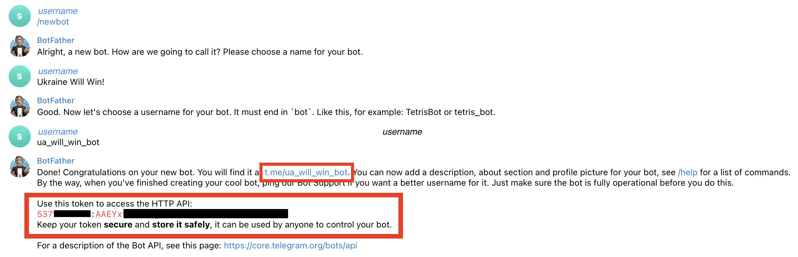
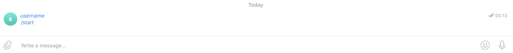
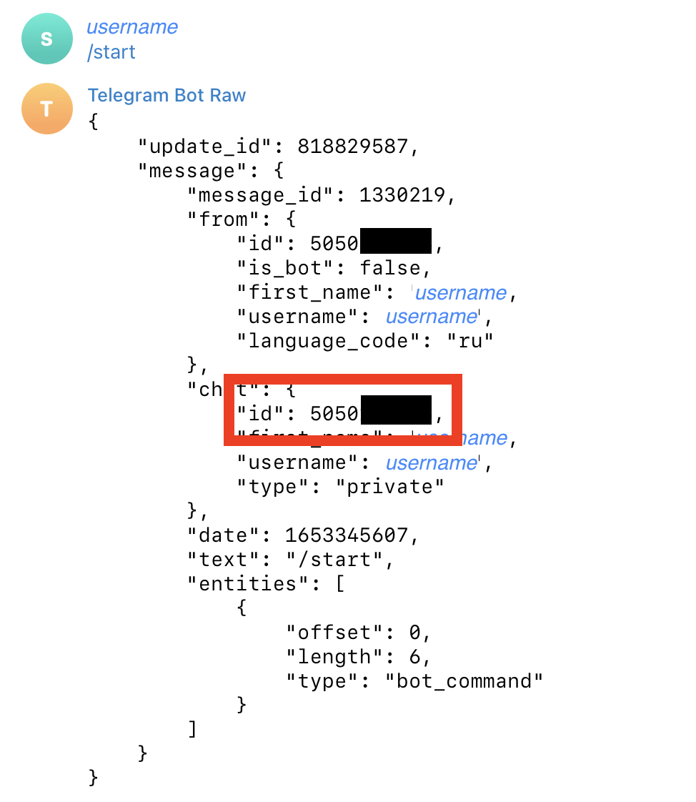
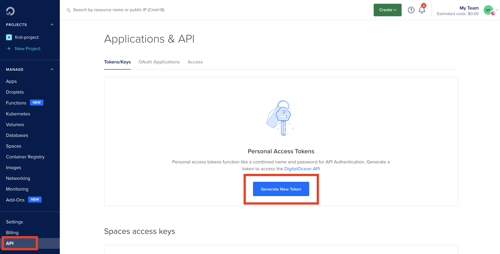
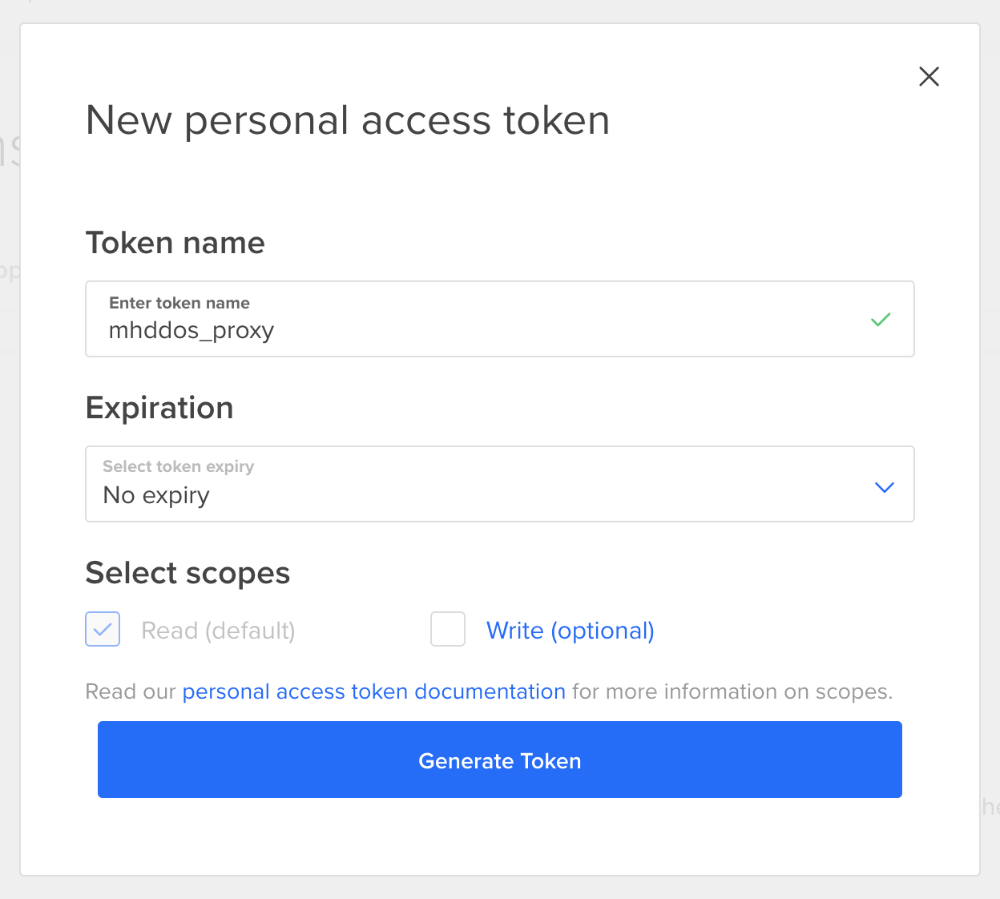
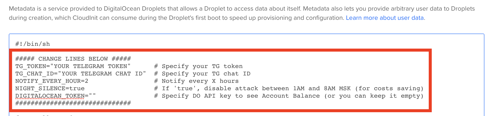

# Встановлювач [mhddos_proxy](https://github.com/porthole-ascend-cinnamon/mhddos_proxy) зі сповіщенням у Telegram 

За цією інструкцією ви зможете налаштувати [mhddos_proxy](https://github.com/porthole-ascend-cinnamon/mhddos_proxy) та сповіщення у Телеграм. Це дасть вам змогу зробити це один раз та завжди знати що відбувається на серверах без потреби перевіряти їх кожного дня. Також, це просто красиво ✨

## Як виглядає сповіщення?

Ви отримаєте наступну інформацію:
1. **Host** - назва сервера
2. **Balance/To pay** - скільки кредитів залишилось та скільки реальних грошей ви витратили (тільки для Digital Ocean)
3. **Threads/Proxies** - кількість потоків та проксі виділених на один процесс mhddos_proxy
4. **Total connections** - скільки зʼєднань встановлено на даний момент
5. **Total requests** - скільки реквестів в секунду відправляєть на даний момент
6. **Total traffic** - загальна кількість трафіку відправляєма на усі цілі (чим більше, тим ефективніша атака)
7. **Top 5 targets by traffic** - цілей може бути сотня, але цікаво знати топ 5 за трафіко - на них йде найсильніша атака
8. **Open health report** - клікабельна кнопка, що направить вас на [трекер цілей від IT Army](https://itarmy.com.ua/check/)

## Як встановити?

> Скрипт налаштування можна використовувати у будь-якому хмарному провайдері та навіть на особистом сервері! У цієї інструкції ми використаємо DigitalOcean, якщо ви запускаєте mhddos_proxy у іншому середвищі, просто ігноруйте кроки повʼязані з DigitalOcean.

### Зареєструйте DigitalOcean аккаунт

Перейдіть [за посиланням](https://try.digitalocean.com/freetrialoffer/) та створіть новий аккаунт, вам дадуть $100 на 60 днів. Ви будете повинні вказати свою банківську карту, з неї спишуть $5 та одразу повернуть. Якщо карту не приймуть (таке буває, все ок), зареєструйтесь через PayPal. Через PayPal ваші $5 не повернуть, але у вас будет не $100, а $105.

Зайдіть у вкладку `Billing`, через 24 години після регістрації ви побачите нараховані кредити.

Скоріш за все, їх не буде одразу, це нормально. Якщо за 24 години кредити не зʼявились, використайте один з промокодів [за цим посиланням](https://www.newcoupons.info/digitalocean-coupon-codes/).

Налаштуйте сповіщення про витрати, це допоможе вам вчасно закрити аккаунт щоб не платити гроші. Ви також можете встановили ліміт на оплати в Інтернеті на вашій карті, на всяк випадок.

### Створіть Телеграм бота

Зайдіть у Телеграм та знайдіть бота [BotFather](https://t.me/BotFather). Створіть свого бота за допомогою команди `/newbot` та занотуйте отриманий токен.

Перейдіть до щойно створеного бота та напишіть йому `/start`. Ви не отримаєте відповіді, але це потрібно, щоб його активувати.

### Отримайте Chat ID

Знайдіть бота [RawDataBot](https://t.me/RawDataBot) та напишіть йому `/start`. Занотуйте значення `chat_id`.

### Створіть API токен у DigitalOcean
> Це потрібно щоб отримувати інформацію про залишок кредитів у аккаунті. Якщо ви запускаєте mhddos_proxy у іншому середовищі або не бажаєте отримувати цю інформацію, пропустіть цей крок.

Оберіть `API` у панелі ліворуч, після чого натисніть `Generate New Token`.

У новому окні введіть будь-яку назву токену, оберіть `No expire` та приберіть позначку біля `Write`, нам це не потрібно.

Збережіть собі значення токену, бо його можна побачити лише один раз!

### Нарешті можна створювати сервера!

Оберіть `Droplets`, `Create Droplets`.

Оберіть:
* Ubuntu 20.04 (LTS)
* Basic
* $15/mo (можна обрати $5/mo, але атака буде слабше)
* Amsterdam London Frankfurt
* Password (введіть пароль)
* Включить Monitoring
* Включить User Data
* Скопіюйте увесь контент [цього файла](https://raw.githubusercontent.com/sadviq99/mhddos_proxy-setup/master/mhddos_setup.sh) до поля User Data

Змініть значення згідно інформації яку ви отримали раніше.

* **TG_TOKEN** - токен отриманий після створення бота
* **TG_CHAT_ID** - отриманий chat_id
* **NOTIFY_EVERY_HOUR** - як часто отримувати нотифікації (кожні Х годин)
* **NIGHT_SILENCE** - виключати атаки між 01:00 - 08:00 МСК (щоб зберегти трохи грошей на трафіку)
* **DIGITALOCEAN_TOKEN** - API токен для Digital Ocean, щоб отримувати інформацію про баланс коштів (залиште пустим якщо разгортаєте це в іншому середовищі)

Оберіть кількість серверів (рекомендую не більше 3), та натисніть `Create Droplet`.

Вітаю! 🙌 Ви щойно долучились до лав IT Армії!

Чекайте сповіщення у Телеграм згідно розкладу, який ви задали вище.

### Перевірка для нетерплячих 🙂

Зачекайте десь 5 хвилин після створення серверу, потім зайдіть на нього на виконайте `./tg.sh`.

### Поради

Не запускайте більше ніж 3 сервера на одному аккаунті, це підвищує шанси блокування аккаунту.

Якщо ви зареєстрували аккаунт у DigitalOcean на уявну пошту `mymail@gmail.com`, ви можете додати `+<число>` (`mymail+1@gmail.com`, `mymail+2@gmail.com`) та створити ще аккаунти, отримуючи листи на ту ж саму `mymail@gmail.com` пошту! Це дуже зручно, ви можете повторювати процес багато разів, скільки завгодно.

Краще використовувати декілька засобів атак, щоб диверсифікувати зусилля. Наприклад, [mhddos_proxy](https://github.com/porthole-ascend-cinnamon/mhddos_proxy) та [db1000n](https://github.com/Arriven/db1000n).

### А можна так само для db1000n?

Звісно можна! Усі інструкції на відео: https://www.youtube.com/watch?v=tFSQJW0vSfI

### Підтримка

Якщо у вас виникли проблеми, запитання, або вам просто потрібна допомога - звертайтеся до телеграм каналів:

* Апдейти - https://t.me/sadviqhelp
* Підтримка - https://t.me/sadviqchat

