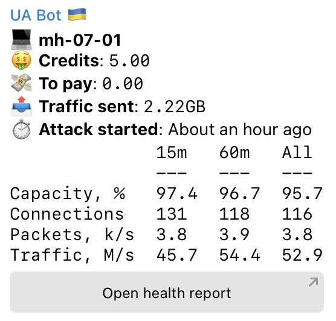

## Встановлювач [mhddos_proxy](https://github.com/porthole-ascend-cinnamon/mhddos_proxy) зі сповіщенням у Telegram 

За цією інструкцією ви зможете налаштувати [mhddos_proxy](https://github.com/porthole-ascend-cinnamon/mhddos_proxy) та сповіщення у Телеграм. Це дасть вам змогу зробити це один раз та завжди знати що відбувається на серверах без потреби перевіряти їх кожного дня. Також, це просто красиво ✨

## Як виглядає сповіщення?

Ви отримаєте наступну інформацію:
1. **Host** - назва сервера.
2. **Threads/Proxies** - кількість потоків та проксі виділених на один процесс mhddos_proxy
3. **Total connections** - скільки зʼєднань встановлено на даний момент
4. **Total requests** - скільки реквестів в секунду відправляєть на даний момент
5. **Total traffic** - загальна кількість трафіку відправляєма на усі цілі (чим більше, тим ефективніша атака)
6. **Top 5 targets by traffic** - цілей може бути сотня, але цікаво знати топ 5 за трафіко - на них йде найсильніша атака
7. **Open health report** - клікабельна кнопка, що направить вас на [трекер цілей від IT Army](https://itarmy.com.ua/check/)

## Як встановити?

> Скрипт налаштування можна використовувати у будь-якому хмарному провайдері та навіть на особистом сервері! У цієї інструкції ми використаємо DigitalOcean, якщо ви запускаєте mhddos_proxy у іншому середвищі, просто ігноруйте кроки повʼязані з DigitalOcean.

### Зареєструйте DigitalOcean аккаунт

Перейдіть [за посиланням](https://try.digitalocean.com/freetrialoffer/) та створіть новий аккаунт, вам дадуть $100 на 60 днів. Ви будете повинні вказати свою банківську карту, з неї спишуть $5 та одразу повернуть. Якщо карту не приймуть (таке буває, все ок), зареєструйтесь через PayPal. Через PayPal ваші $5 не повернуть, але у вас будет не $100, а $105.

Зайдіть у вкладку `Billing`, через 24 години після регістрації ви побачите нараховані кредити.

Скоріш за все, їх не буде одразу, це нормально. Якщо за 24 години кредити не зʼявились, використайте один з промокодів [за цим посиланням](https://www.newcoupons.info/digitalocean-coupon-codes/).

Налаштуйте сповіщення про витрати, це допоможе вам вчасно закрити аккаунт щоб не платити гроші. Ви також можете встановили ліміт на оплати в Інтернеті на вашій карті, на всяк випадок.

### Створіть Телеграм бота

Зайдіть у Телеграм та знайдіть бота [BotFather](https://t.me/BotFather). Створіть свого бота за допомогою команди `/newbot` та занотуйте отриманий токен.

Перейдіть до щойно створеного бота та напишіть йому `/start`. Ви не отримаєте відповіді, але це потрібно, щоб його активувати.

### Отримайте Chat ID

Знайдіть бота [RawDataBot](https://t.me/RawDataBot) та напишіть йому `/start`. Занотуйте значення `chat_id`.

### Створіть API токен у DigitalOcean
> Це потрібно щоб отримувати інформацію про залишок кредитів у аккаунті. Якщо ви запускаєте mhddos_proxy у іншому середовищі або не бажаєте отримувати цю інформацію, пропустіть цей крок.

Оберіть `API` у панелі ліворуч, після чого натисніть `Generate New Token`.

У новому окні введіть будь-яку назву токену, оберіть `No expire` та приберіть позначку біля `Write`, нам це не потрібно.

Збережіть собі значення токену, бо його можна побачити лише один раз!

### Нарешті можна створювати сервера!

